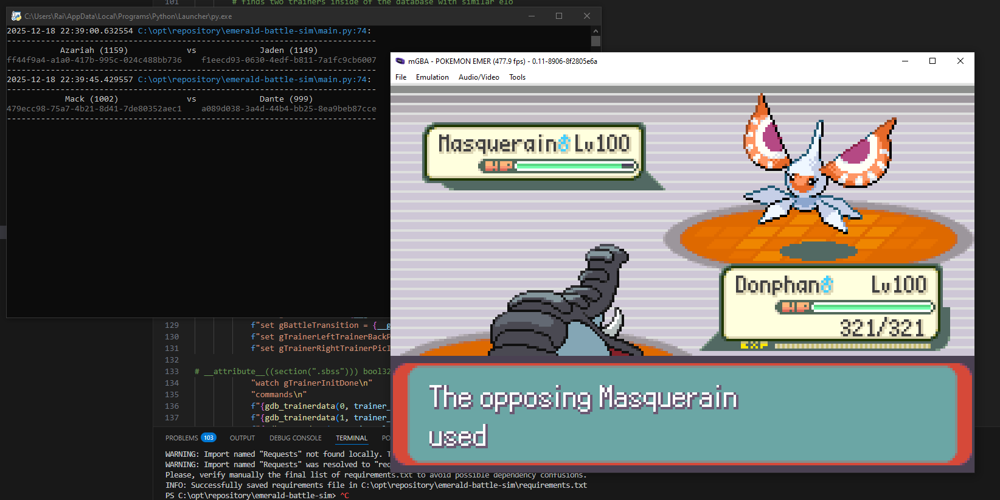
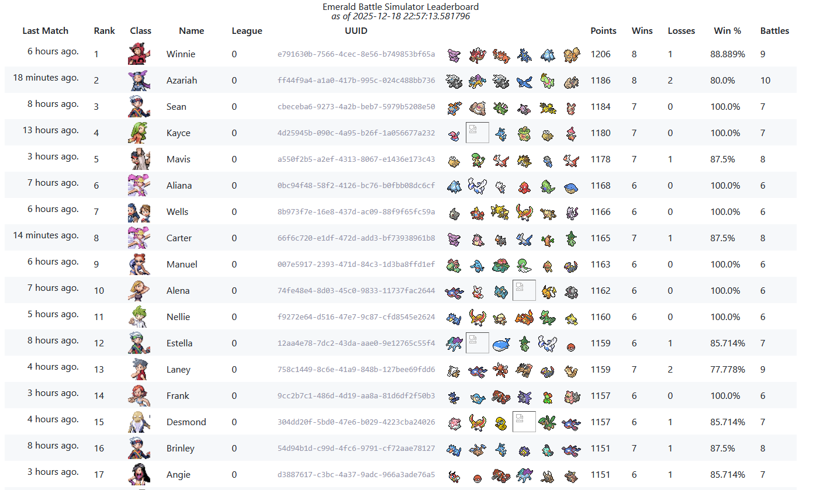

# emerald-battle-sim

Pokemon emerald battle simulator with a fully functioning elo system and leaderboard

* [prerequesites](#prerequesites)
* [usage](#usage)
    * [creating players](#creating-players)
    * [running](#running)
* [todo list](#todo-list)

## prerequesites
- a custom fork of pokeemerald-expansion
    - copy the debug elf file `pokeemerald.elf` and linker map `pokeemerald.map` into the project's res folder
    - i cannot provide prebuilt roms for obvious reasons. build instructions are in the fork readme
- devkitpro installed (recommended to also have devkitARM's gdb executable in your PATHs located in `(devkitpro dir)/devkitARM/bin/`)
- a build of mgba coppied into `res/mgba`

## usage
### creating players
- in order to add players, run `pokemon.py`
    - there are a couple of variables that can be adjusted
        - `SHINY_ODDS`: adjusts the chance of trainer's pokemon to be a shiny `(1 / SHINY_ODDS)`
        - `PLAYER_COUNT`: amount of players that will be added to the player pool
        - `DEFAULT_TRAINER_AI_FLAGS`: the default ai flags that trainers will use
            - explaination of each ai flag are inside of the `__ai_flags` enum inside of `poke_data.py`, but they mostly dont need to be changed
### running
- once players have been added, run `main.py`
- saved information about the leaderboard are stored in the `dump/` directory, and a viewable html page of the leaderboard is stored at `website/html/leaderboard.html`
### todo list
- [ ] remove requirement for a custom fork of pokeemerald-expansion 
- [ ] prevent database from being recalculated every match, takes a lot of time if there are a lot of matches in the battle logs

